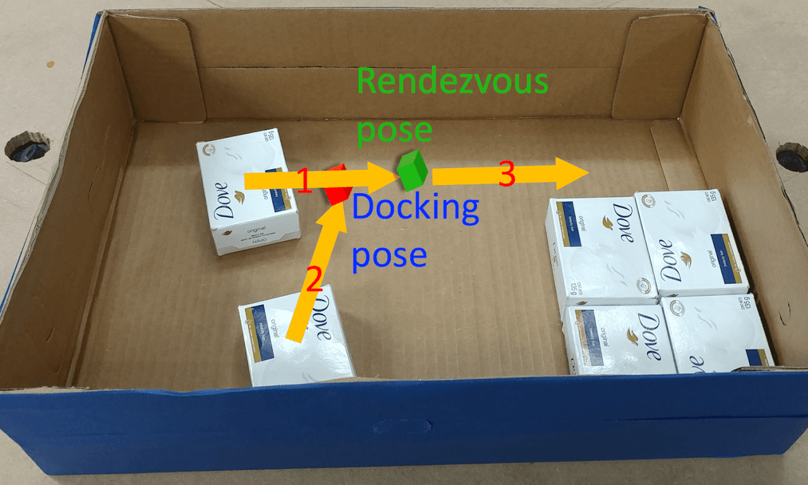
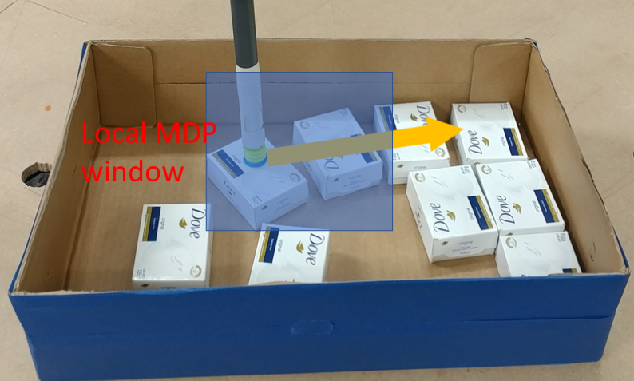
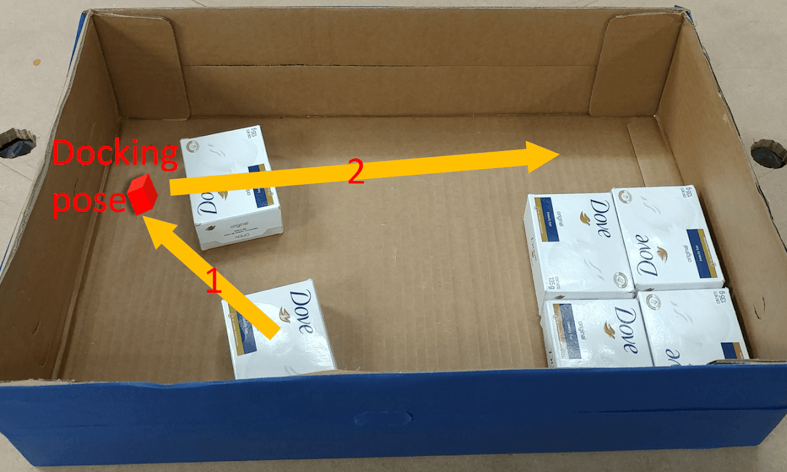
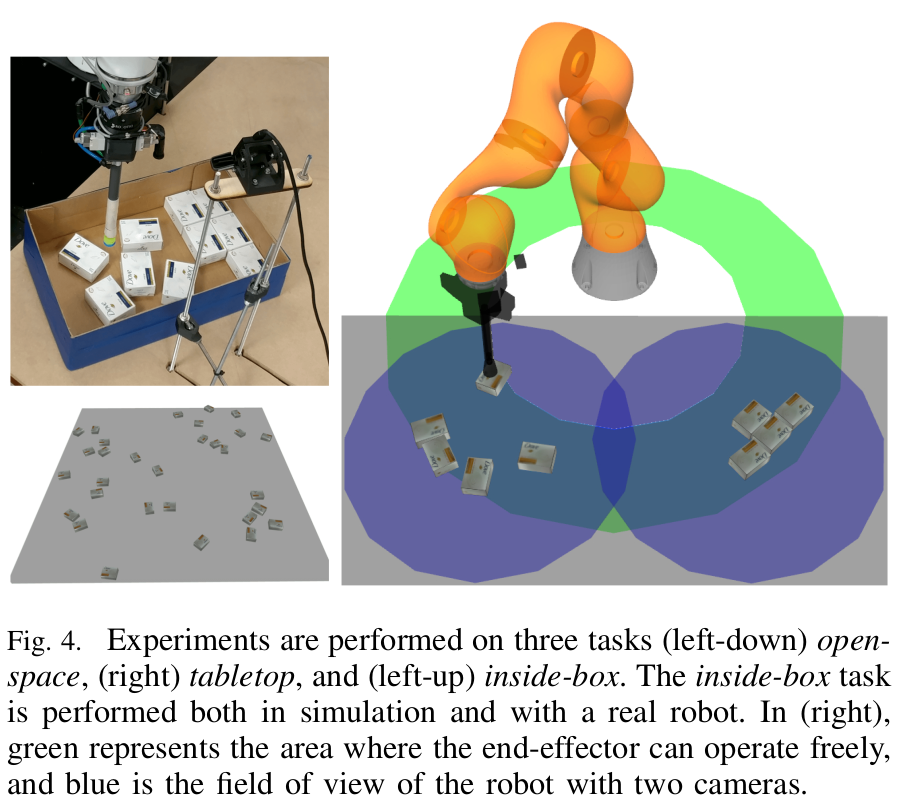
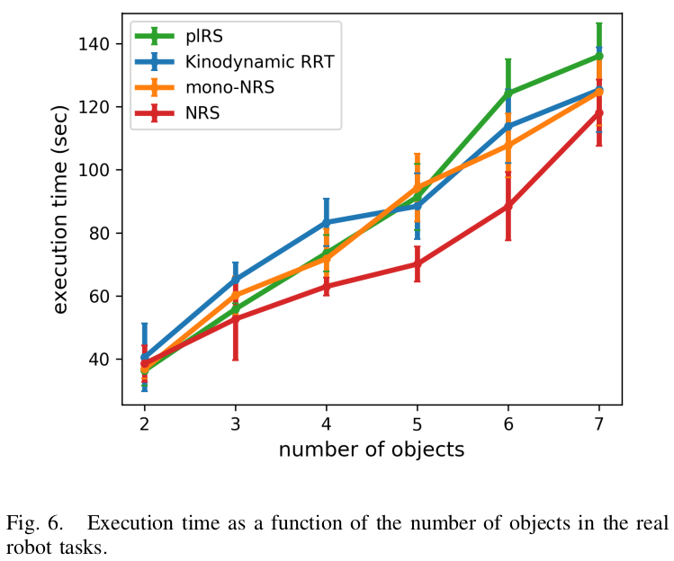
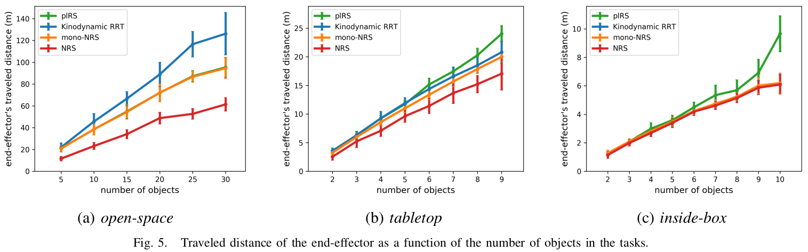

# Object Rearrangement with Nested Nonprehensile Manipulation Actions

Changkyu Song and Abdeslam Boularias, Object Rearrangement with Nested Nonprehensile Manipulation Actions, IEEE/RSJ International Conference on Intelligent Robots and Systems (IROS 2019), Nov. 4-8th, 2019, Macau, China. [[PDF]](https://arxiv.org/pdf/1905.07505.pdf) [[Video]](https://www.youtube.com/watch?v=ep7ZBCVQhiA) [[Project Page]](https://sites.google.com/site/changkyusong86/research/iros2019) 

This paper considers the problem of rearrange-ment planning, i.e finding a sequence of manipulation actionsthat displace multiple objects from an initial configuration toa given goal configuration. Rearrangement is a critical skillfor robots so that they can effectively operate in confinedspaces that contain clutter. Examples of tasks that requirerearrangement include packing objects inside a bin, whereinobjects need to lay according to a predefined pattern. In tightbins, collision-free grasps are often unavailable. Nonprehensileactions, such as pushing and sliding, are preferred becausethey can be performed using minimalistic end-effectors that caneasily be inserted in the bin. Rearrangement with nonprehensileactions is a challenging problem as it requires reasoning aboutobject interactions in a combinatorially large configurationspace of multiple objects. This work revisits several existing re-arrangement planning techniques and introduces a new one thatexploits nested nonprehensile actions by pushing several similarobjects simultaneously along the same path, which removesthe need to rearrange each object individually. Experiments insimulation and using a real Kuka robotic arm show the abilityof the proposed approach to solve difficult rearrangement taskswhile reducing the length of the end-effector’s trajectories.

{:width="33%"}
{:width="33%"}
{:width="33%"}

# Results

{:width="50%"}
{:width="50%"}
{:width="100%"}

# Author

[Changkyu](https://sites.google.com/site/changkyusong86) (changkyusong86@gmail.com)
